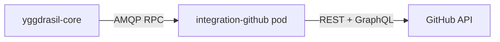

<div align="center">

# `integration-github`

**Yggdrasil adapter for GitHub** — dispatch workflows, manage repos and environments from declarative Yggdrasil workflows

[](LICENSE)
[](https://github.com/dakasa-yggdrasil/integration-github/pkgs/container/integration-github)
[](https://github.com/dakasa-yggdrasil/yggdrasil-core)

</div>

---

## What it does

GitHub operations plugin for Yggdrasil. Registers under the `github` family.

| Operation | Purpose |
|---|---|
| `dispatch_workflow` | Trigger a GitHub Actions workflow run with typed inputs. |
| `list_workflow_runs` | Enumerate runs of a given workflow. |
| `describe_workflow_run` | Fetch a run's status + logs URL. |
| `ensure_repository_environment` | Idempotently upsert a protected environment. |
| `ensure_repository_secret` | Manage repository / environment secrets. |

## Install

```sh
yggdrasil install dakasa-yggdrasil/integration-github
```

## Example workflow step

```yaml
- id: deploy
  use:
    kind: integration
    family: github
    operation: dispatch_workflow
  with:
    repository: my-org/my-service
    workflow: deploy.yml
    ref: main
    inputs:
      environment: "{{ inputs.env }}"
      image_tag: "{{ inputs.sha }}"
```

## Credentials

- GitHub App (recommended): `app_id`, `installation_id`, `private_key_ref` (managed secret)
- Personal Access Token (simpler for trial): `token` (managed secret)

## Architecture



## Development

```sh
go test ./...
docker build -t integration-github:dev .
```

## License

Apache 2.0 — see [LICENSE](LICENSE).

---

<div align="center">

Part of [Yggdrasil](https://github.com/dakasa-yggdrasil/yggdrasil-core) · [Catalog](https://github.com/dakasa-yggdrasil/yggdrasil-core/blob/main/docs/catalog.md)

</div>
